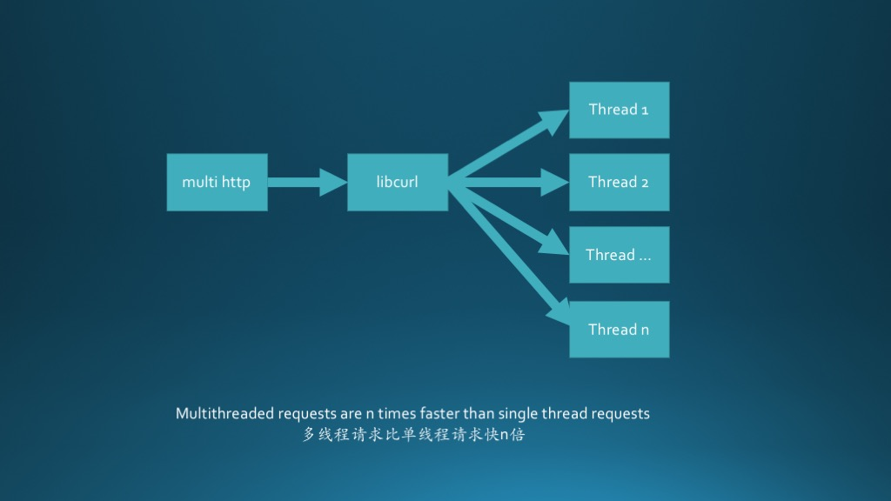

# MultiHttp

[](https://travis-ci.org/sinacms/MultiHttp)
[](https://scrutinizer-ci.com/g/sinacms/MultiHttp)
[](https://scrutinizer-ci.com/g/sinacms/MultiHttp/)
    
    
    This is high performance curl wrapper written in pure PHP.
    It's compatible with PHP 5.4+ and HHVM.
    Notice that libcurl version must be over 7.36.0,  otherwise timeout can not suppert decimal.
    
    这是一个高性能的PHP封装的HTTP Restful多线程并发请求库，参考借鉴了httpresful 、multirequest等优秀的代码。它与PHP 5.4和hhvm兼容。
    注意，libcurl版本必须>=7.36.0，否则超时不支持小数。
    
    




## Contents

 * [Feature](#feature)
 * [Installation](#installation)
 * [Usage](#usage)
   * [Single-request](single-request)
   * [Multi-request](multi-request)
 * [Documentation](#documentation)
   * [Request](#request)
   * [MultiRequest](#multiRequest)
 


    
## Feature
 - alias of curl option, e.g.  'timeout' equals 'CURLOPT_TIMEOUT' etc.
 - Request  and  MultiRequest class  ,  can be used in any combination 
 - graceful and efficient

## Installation

   You can use composer to install this library from the command line.
```bash
composer require sinacms/multihttp
```   

   
## Usage

### Single-request:


```php
<?php
// Include Composer's autoload file if not already included.
require_once __DIR__.'/vendor/autoload.php';
use MultiHttp\Request;
use MultiHttp\Response;

//method 1
Request::create()->get('http://sina.com.cn', array(
          'timeout' => 3,
	  'expects_mime'=>'json',
	  'retry_times' => 3,
	  'ip' => '127.0.0.1:8080',//alias for proxy, better than raw proxy
          'callback' => function (Response $response) {
              echo $response->body;
          },
          ))->send();
      
//method 2
$result = Request::create()->post(
      'http://127.0.0.1',array('data'=>'this_is_post_data'), array(
          'callback' => function (Response $response) {
              echo $response->body;
          }))->send();

``` 


### Multi-request:
 
```php
<?php
require_once __DIR__.'/vendor/autoload.php';
use MultiHttp\MultiRequest;
use MultiHttp\Response;


$mr  = MultiRequest::create();
$rtn = $mr->add('GET', 'http://sina.cn',array(), array(
                  'timeout' => 3,
                  'callback' => function (Response $response) {
                                  echo $response->body;
                              }
              ))
          ->add('GET', 'http://google.cn',array(), array(
                  'timeout' => 3,
                  'callback' => function (Response $response) {
                                  echo $response->body;
                              }
              ))    
	      ->sendAll();

?>
``` 

## Documentation 
  * ### Request
   * #### option shorthand
    		'url'             => 'CURLOPT_URL',
    		'debug'           => 'CURLOPT_VERBOSE',//for debug verbose
    		'method'          => 'CURLOPT_CUSTOMREQUEST',
    		'data'            => 'CURLOPT_POSTFIELDS', // array or string , file begin with '@'
    		'ua'              => 'CURLOPT_USERAGENT',
    		'timeout'         => 'CURLOPT_TIMEOUT', // (secs) 0 means indefinitely
    		'connect_timeout' => 'CURLOPT_CONNECTTIMEOUT',
    		'referer'         => 'CURLOPT_REFERER',
    		'binary'          => 'CURLOPT_BINARYTRANSFER',
    		'port'            => 'CURLOPT_PORT',
    		'header'          => 'CURLOPT_HEADER', // TRUE:include header
    		'headers'         => 'CURLOPT_HTTPHEADER', // array
    		'download'        => 'CURLOPT_FILE', // writing file stream (using fopen()), default is STDOUT
    		'upload'          => 'CURLOPT_INFILE', // reading file stream
    		'transfer'        => 'CURLOPT_RETURNTRANSFER', // TRUE:return string; FALSE:output directly (curl_exec)
    		'follow_location' => 'CURLOPT_FOLLOWLOCATION',
    		'timeout_ms'      => 'CURLOPT_TIMEOUT_MS', // milliseconds,  libcurl version > 7.36.0 ,
   
   * public static function create()
   * public function endCallback()
   * public function hasEndCallback()
   * public function onEnd(callable$callback)
   * public function uri
   * public function getIni($field)
   * public function addQuery($data)
   * public function post($uri, array $payload = array(), array $options = array())
   * public function addOptions(array $options = array())
   * public function get($uri, array $options = array())
   * public function send()
   * public function applyOptions()
   * public function makeResponse($isMultiCurl = false)
  * ### MultiRequest
   * public static function create()
   * public function addOptions(array $URLOptions)
   * public function add($method, $uri, array $payload = array(), array $options = array())
   * public function import(Request $request)
   * public function sendAll()


   [More][https://github.com/sinacms/MultiHttp/blob/master/usage.md](https://github.com/sinacms/MultiHttp/blob/master/usage.md)
